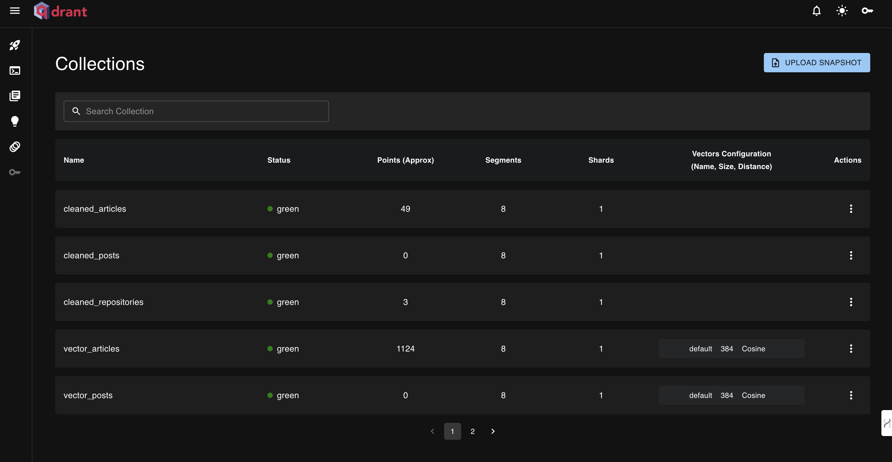

# Install 

## Local dependencies

Before starting to install the Praxis LLM project, make sure you have installed the following dependencies on your local system:

| Tool | Version | Purpose | Installation Link |
|------|---------|---------|------------------|
| Python | 3.12 | Runtime environment | [Download](https://www.python.org/downloads/) |
| UV | ≥0.7.5 | Package management | [Install Guide](https://docs.astral.sh/uv/getting-started/installation/) |
| GNU Make | ≥3.81 | Build automation | [Install Guide](https://www.gnu.org/software/make/) |
| Docker | ≥27.0.3 | Containerization | [Install Guide](https://www.docker.com/) |
getting-started-install.html) |

## Cloud services

The code also uses and depends on the following cloud services. For now, you don't have to do anything. We will guide you in the installation and deployment sections on how to use them:

| Service | Purpose | Cost | Mandatory Credentials |
|---------|---------|---------|---------|
| [Hugging Face](https://huggingface.co/) | Model serving | Free tier available | `HUGGINGFACE_ACCESS_TOKEN` |
| [MongoDB](https://www.mongodb.com) | Document Store | Free tier available | `MONGODB_CONNECTION_STRING` |
| [Qdrant](https://qdrant.tech) | Vector DB | Free tier available | `QDRANT_HOST` <br> `QDRANT_PORT` |
| [MLflow](https://mlflow.org) | Experiment tracker | Free and open-source | `MLFLOW_TRACKING_URI` <br> `MLFLOW_EXPERIMENT_NAME` |
| [Opik](https://www.comet.com/site/products/opik/) | Prompt monitoring | Free tier available | `COMET_API_KEY` <br> `COMET_WORKSPACE` |
| [Bytewax](https://bytewax.io) | Stateful Stream Processing | Open-source | None. Included in the Docker setup. |
| [OpenAI API](https://openai.com/index/openai-api/) | LLM API for recommender system | Pay-per-use | `OPENAI_API_KEY` | [Quick Start Guide](https://platform.openai.com/docs/quickstart) |

> [!IMPORTANT]
> You need a Hugging Face account and API token. [Get one here](https://huggingface.co/settings/tokens).

## Clone the repository
```shell
git clone https://github.com/DevJadhav/Praxis-LLM.git
```
## Supported commands

We will use `GNU Make` to install and run our application.

To see all our supported commands, run the following:
```shell
make help
```

## Configure

All the sensitive credentials are placed in a `.env` file that will always sit at the root of your directory, at the same level with the `.env.example` file.

Go to the root of the repository and copy our `.env.example` file as follows:
```shell
cp .env.example .env
```
Now fill it with your credentials, following the suggestions from the next section.

### Getting credentials for cloud services

Now, let's understand how to fill in all the essential variables within the `.env` file to get you started. The following are the mandatory settings we must complete when working locally:

#### OpenAI

To authenticate to OpenAI's API, you must fill out the `OPENAI_API_KEY` env var with an authentication token.

```env
OPENAI_API_KEY=your_api_key_here
```

→ Check out this [tutorial](https://platform.openai.com/docs/quickstart) to learn how to provide one from OpenAI.

#### Hugging Face

To configure Hugging Face, you must fill out the `HUGGINGFACE_API_ENDPOINT` and `HUGGINGFACE_ACCESS_TOKEN` env vars:

```env
HUGGINGFACE_API_ENDPOINT=https://api-inference.huggingface.co
HUGGINGFACE_ACCESS_TOKEN=your_huggingface_api_token
MODEL_ID=google/gemma-3-4b-it
```

→ Check out this [tutorial](https://huggingface.co/docs/api-inference/index) to learn more about using Hugging Face Inference API.

#### MLflow

To authenticate to MLflow, you must fill out the `MLFLOW_TRACKING_URI` and `MLFLOW_EXPERIMENT_NAME` env vars with your tracking URI and experiment name.

```env
MLFLOW_TRACKING_URI=http://mlflow:5000
MLFLOW_EXPERIMENT_NAME=llm-praxis
```

→ Check out this [tutorial](https://mlflow.org/docs/latest/tracking.html) to learn how to get the MLflow variables from above.

#### Vector Database

To authenticate to Qdrant or Milvus, you must fill out the `QDRANT_HOST` and `QDRANT_PORT` env vars with your host and port.

```env
QDRANT_HOST=localhost
QDRANT_PORT=6333
QDRANT_COLLECTION_NAME=praxis_documents
```

→ Check out this [tutorial](https://qdrant.tech/documentation/concepts/connect/) to learn how to get the Qdrant variables from above.


## Install local dependencies

You can create a Python virtual environment and install all the necessary dependencies using Poetry, by running:
```shell
make install
```
> [!IMPORTANT] 
> You need Python 3.11 installed! You can either install it globally or install [pyenv](https://github.com/pyenv/pyenv) to manage multiple Python dependencies. The `.python-version` file will signal to `pyenv` what Python version it needs to use in this particular project.

After installing the dependencies into the Poetry virtual environment, you can activate your virtual environment into your current CLI by running:
```bash
poetry shell
```

## Set up the data infrastructure

We support running the entire data infrastructure (crawling, CDC, MongoDB, and Qdrant) through Docker. Thus, with a few commands you can quickly populate the data warehouse and vector DB with relevant data to test out the RAG, training, and inference parts of the course.

### Spin up the infrastructure

You can start all the required Docker containers, by running:
```shell
make local-start
```
It will take a while to run until all the Docker images are pulled or built.

Behind the scenes it will build and run all the Docker images defined in the docker-compose.yml file.

> [!CAUTION]
> For `MongoDB` to work with multiple replicas (as we use it in our Docker setup) on `macOS` or `Linux` systems, you have to add the following lines of code to `/etc/hosts`:
>
> ```
> 127.0.0.1       mongo1
> 127.0.0.1       mongo2 
> 127.0.0.1       mongo3
> ```
>
> From what we know, on `Windows`, it `works out-of-the-box`.

> [!WARNING]
> For `arm` users (e.g., `M macOS devices`), go to your Docker desktop application and enable `Use Rosetta for x86_64/amd64 emulation on Apple Silicon` from the Settings. There is a checkbox you have to check.
> Otherwise, your Docker containers will crash.

### Tear down the infrastructure

Run the following `Make` command to tear down all your docker containers:

```shell
make local-stop
```

# Usage: Run an end-to-end flow

Now that we have configured our credentials, local environment and Docker infrastructure let's look at how to run an end-to-end flow of the Praxis LLM course.

> [!IMPORTANT]
> Note that we won't go into the details of the system here. 

### Step 1: Crawling data

Trigger the crawler to collect data and add it to the MongoDB:

```shell
make local-test-medium
# or make local-test-github
``` 
You should get a response with a `200` status code, as follows:
```
{"statusCode": 200, "body": "Link processed successfully"}
```

After running the command, this will happen:
1. it will crawl a Medium/GitHub link
2. process and add the data to MongoDB
3. the CDC component will be triggered, which will populate the RabbitMQ with the event
4. the RAG feature pipeline will read the event from RabbitMQ, process it for RAG, and add it to the Qdrant vector DB

You can check the logs from the crawler Docker image, by running:
```bash
docker logs praxis-llm-data-crawlers
``` 
You should see something similar to:
```text
{"level":"INFO","location":"extract:53","message":"Finished scrapping custom article: https://medium.com/mlwithdev/the-art-of-security-testing-of-secure-ml-systems-using-mlops-ml-testing-series-part-4-7b955b78c0bc","timestamp":"2024-12-25 17:13:33,630+0000","service":"praxis-llm-workshop/crawler"}
```

### Step 2: Feature engineering & Vector DB

The previous step actually called both the crawling and RAG feature engineering pipeline. But now, let's check that everything worked as expected.

Thus, let's check that the feature pipeline works and the vector DB is successfully populated.

To do so, check the logs of the `praxis-llm-feature-pipeline` Docker container by running:
```shell
docker logs praxis-llm-feature-pipeline
```
You should see something similar to:
```text
2024-12-25 16:53:45 [info     ] Cleaned content chunked successfully. cls=data_logic.dispatchers data_type=repositories num=955
2024-12-25 16:53:45 [info     ] Chunk embedded successfully.   cls=data_logic.dispatchers data_type=repositories embedding_len=384
2024-12-25 16:53:45 [info     ] Chunk embedded successfully.   cls=data_logic.dispatchers data_type=repositories embedding_len=384
```
Also, you can check the logs of the CDC and RabbitMQ Docker containers, by running:
```bash
docker logs praxis-llm-data-cdc # CDC service
docker logs praxis-llm-mq # RabbitMQ
```

You should see logs reflecting the cleaning, chunking, and embedding operations (without any errors, of course).

To check that the Qdrant `vector DB` is populated successfully, go to its dashboard by typing in your browser: **[localhost:6333/dashboard](localhost:6333/dashboard)**. There, you should see the repositories or article collections created and populated, similar to the image below:



> [!NOTE]
> If using the cloud version of Qdrant, go to your Qdrant account and cluster to see the same thing as in the local dashboard.

### Step 3: Populating MongoDB and Qdrant with more data

To populate MongoDB and VectorDB with ~50 links, run the following command (but first make sure that everything runs smooth):
```bash
make local-ingest-data
```
**Note:** To crawl different links, you can change the `data/links.txt` file. 

### Step 4: Testing the RAG retrieval step

Now that our Qdrant vector DB is populated with our data let's test out the RAG retrieval module to see that everything works fine by retrieving some items using a dummy query:
```shell
make local-test-retriever
```

> [!IMPORTANT]
> Before running this command, check [Qdrant's dashboard](localhost:6333/dashboard) to ensure your vector DB is populated with data. Otherwise, the retriever will not have any data to work with.

### Step 5: Generating the instruct dataset

The last step before fine-tuning is to generate an instruct dataset and track it as an artifact with MLflow. To do so, run:
```shell
make local-generate-instruct-dataset
```

Now go to [MLflow](http://mlflow:5000), then to your experiment, and open the `Artifacts` tab. There, you should find three artifacts as follows:
> - `articles-instruct-dataset` 
> - `posts-instruct-dataset`
> - `repositories-instruct-dataset`

To download the instruct dataset from MLflow, run:
```bash
make download-instruct-dataset
```

### Step 6 : Starting the fine-tuning pipeline

First, make sure you have the necessary Hugging Face libraries installed. We'll use the google/gemma-3-4b-it model for fine-tuning.

Next, kicking off the training in dummy mode is as easy as running the following (dummy mode will reduce the dataset size and epochs to quickly see that everything works fine, reducing the running time <30 minutes):
```bash
make start-training-pipeline-dummy-mode
```

To kick off the full training, run (which will take ~2-3 hours, using our dataset and preconfigured settings):
```bash
make start-training-pipeline
```

After training completes, the fine-tuned model will be saved and registered with MLflow. 

To run the evaluation and inference using your fine-tuned LLM, update your `.env` file with the Hugging Face model ID, such as `HUGGINGFACE_MODEL_ID=google/gemma-3-4b-it`.

> [!NOTE]
> You can check the training progress in the MLflow dashboard at http://localhost:5001.


### Step 8: Runing the evaluation pipelines

After you have finetuned your LLM, you can start the LLM evaluation pipeline by running:
```shell
make evaluate-llm
```

To start the RAG evaluation pipeline, run:
```shell
make evaluate-rag
```

Next, check the evaluation datasets and experiment results in [MLflow](http://mlflow:5000).


### Step 9: Testing the inference pipeline

After you have finetuned and evaluated your model, the first step is to deploy the LLM to MLFLow as a REST API service:
```shell
make deploy-inference-pipeline 
```

> [!NOTE]
> You can check out the deployment progress in the MLFlow dashboard.

After the deployment is finished (it will take a few minutes), you can call it with a test prompt by running:
```shell
make call-inference-pipeline
```

After testing the inference pipeline from the CLI, you can start playing around with the Praxis LLM from our GUI, by running:
```shell
make local-start-ui
```

Now you can access the GUI at **[http://localhost:7860](http://localhost:7860)** and start asking the Praxis LLM to generate some content for you, such as: **"Draft a post about RAG systems."** as in the example below:


After playing around with the model, you will start collecting and monitoring your prompts which you can visualize again in [MLflow](http://mlflow:5000).

Also, you can kick off the monitoring LLM evaluation pipeline by running:
```bash
make evaluate-llm-monitoring
```

Ultimately, after testing the inference pipeline, you can delete the deployment, by running:
```shell
make delete-inference-pipeline-deployment
```

## Environment Setup

1. Fill out the `.env` file properly:

```shell
# Hugging Face Configuration
HUGGINGFACE_API_ENDPOINT=https://api-inference.huggingface.co
HUGGINGFACE_ACCESS_TOKEN=your_huggingface_token_here
HUGGINGFACE_MODEL_ID=google/gemma-3-4b-it

# API Keys
OPENAI_API_KEY=your_openai_api_key_here

# MLflow Tracking (for experiment tracking)
MLFLOW_TRACKING_URI=http://mlflow:5000
MLFLOW_EXPERIMENT_NAME=llm-praxis

# Opik/Comet ML (for prompt monitoring)
COMET_API_KEY=your_api_key_here
COMET_WORKSPACE=your_workspace_name_here
COMET_PROJECT=praxis-llm

# Vector Database config
QDRANT_HOST=localhost
QDRANT_PORT=6333
QDRANT_COLLECTION_NAME=praxis_documents
```

2. Install MLflow, Opik, and Hugging Face libraries:
```bash
pip install mlflow opik transformers huggingface-hub torch
```

You can start the MLflow UI locally using:
```bash
make start-mlflow-ui
```

Or access the MLflow UI in Docker at http://localhost:5001 after running:
```bash
make local-start
```
