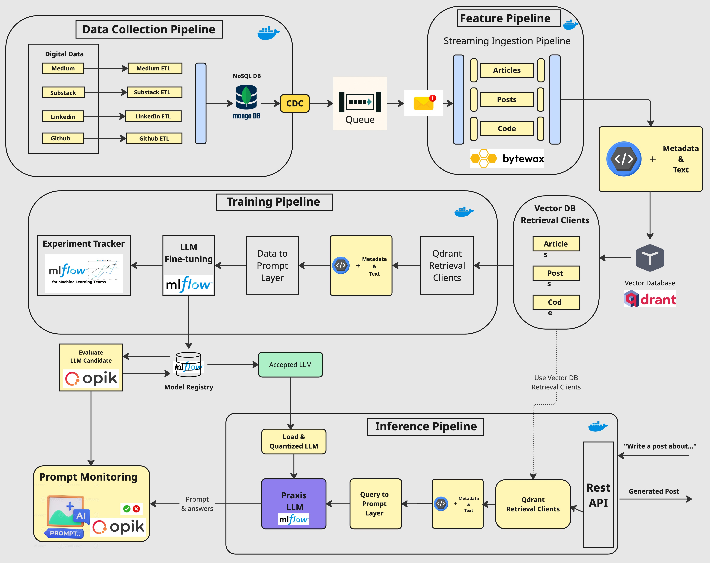

<div align="center">
    <h2>Praxis LLM Course: Developing & Deploying Advanced AI Assistants</h2>
    <h1>Learn to architect and implement a production-ready LLM & RAG system by building your Praxis LLM</h1>
    <h3>From data gathering to productionizing LLMs using LLMOps good practices.</h3>
</div>

</br>


## 🎯 What you'll learn

*By finishing the **"Praxis: Developing & Deploying Advanced AI Assistants"** free course, you will learn how to design, train, and deploy a production-ready Praxis LLM of yourself powered by LLMs, vector DBs, and LLMOps good practices.*

**No more isolated scripts or Notebooks!** Learn production ML by building and deploying an end-to-end production-grade LLM system.


## 📖 About this course

You will **learn** how to **architect** and **build a real-world LLM system** from **start** to **finish** - from **data collection** to **deployment**.

You will also **learn** to **leverage MLOps best practices**, such as experiment trackers, model registries, prompt monitoring, and versioning.

**The end goal?** Build and deploy your own Praxis LLM.

**What is an Praxis LLM?** It is an AI character that learns to write like somebody by incorporating its style and personality into an LLM.

## 🪈 The architecture of the Praxis LLM is split into 4 Python microservices

<p align="center">
  
</p>

### The data collection pipeline

- Crawl your digital data from various social media platforms, such as Medium, Substack and GitHub.
- Clean, normalize and load the data to a [Mongo NoSQL DB](https://www.mongodb.com/) through a series of ETL pipelines.
- Send database changes to a [RabbitMQ](https://www.rabbitmq.com/) queue using the CDC pattern.
- Learn to package the crawlers.

### The feature pipeline

- Consume messages in real-time from a queue through a Bytewax streaming pipeline.
- Every message will be cleaned, chunked, embedded and loaded into a Qdrant vector DB.

### The training pipeline

- Create a custom instruction dataset based on your custom digital data to do SFT.
- Fine-tune an LLM using LoRA or QLoRA.
- Use MLflow's experiment tracker to monitor experiments and log models.
- Evaluate the LLM using Opik for prompt evaluation.
- Save and version the best model in the MLflow model registry.
- Serve models locally with MLflow for inference and evaluation.

### The inference pipeline

- Load the fine-tuned LLM from the MLflow model registry.
- Deploy the LLM locally as a REST API using MLflow model serving.
- Enhance the prompts using advanced RAG techniques.
- Monitor the prompts and LLM generated results using Opik.
- Wrap up everything with a Gradio UI (as seen below) where you can start playing around with the Praxis LLM to generate content that follows your writing style.

<p align="center">
  
</p>

Along the 4 microservices, you will learn to integrate these tools:

* [MLflow](https://mlflow.org/) as your experiment tracker, artifact registry, and model serving platform
* [Opik](https://github.com/comet-ml/opik) as your prompt evaluation and monitoring tool
* [Qdrant](https://qdrant.tech/) as your vector DB
* Local deployment for model serving and inference

## 👥 Who should join?

**This course is ideal for:**
- ML/AI engineers who want to learn to engineer production-ready LLM & RAG systems using LLMOps good principles
- Data Engineers, Data Scientists, and Software Engineers wanting to understand the engineering behind LLM & RAG systems

**Note:** This course focuses on engineering practices and end-to-end system implementation rather than theoretical model optimization or research.

## 🎓 Prerequisites

| Category | Requirements |
|----------|-------------|
| **Skills** | Basic understanding of Python and Machine Learning |
| **Hardware** | Any modern laptop/workstation will do the job, as the LLM fine-tuning and inference will be done on MLFlow.|
| **Level** | Intermediate |


## Lessons

This self-paced course consists of 12 comprehensive lessons covering theory, system design, and hands-on implementation.

Our recommendation for each module:
1. Read the article
2. Run the code to replicate our results
3. Go deeper into the code by reading the `src` Python modules

> [!NOTE]
> Check the INSTALL_AND_USAGE doc for a step-by-step installation and usage guide.

## 🏗️ Project Structure

```text
praxis-llm/
├── src/                     # Source code for all the ML pipelines and services
│ ├── data_crawling/         # Data collection pipeline code
│ ├── data_cdc/              # Change Data Capture (CDC) pipeline code
│ ├── feature_pipeline/      # Feature engineering pipeline code
│ ├── training_pipeline/     # Training pipeline code
│ ├── inference_pipeline/    # Inference service code
├── .env.example             # Example environment variables template
├── Makefile                 # Commands to build and run the project
├── pyproject.toml           # Project dependencies
```

## 🚀 Production Deployment with MLflow

This project now uses MLflow for end-to-end model management:

1. **Experiment Tracking**: Track model training metrics, parameters, and artifacts
2. **Model Registry**: Register and version models for production deployment
3. **Model Serving**: Serve models as REST APIs for inference

To deploy a model to production:

```bash
# 1. Start MLflow UI and tracking server
make start-mlflow-ui

# 2. Train and register your model (automatically registered as "PraxisLLM-Finetuned")
make local-start-training-pipeline

# 3. Serve your model
make serve-local-model
```

The model will be available at `http://localhost:1234/invocations` with a REST API interface.

For prompt monitoring, Opik is still used to track and evaluate prompts and completions.

## 🚀 Install & Usage

To understand how to **install and run the Praxis LLM code end-to-end**, go to the INSTALL_AND_USAGE dedicated document.

## Credits
**This repo has been developed using the [LLM-twin Course](https://github.com/decodingml/llm-twin-course?tab=readme-ov-file) by Decoding ML.**